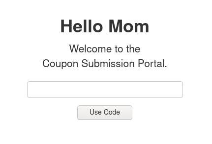
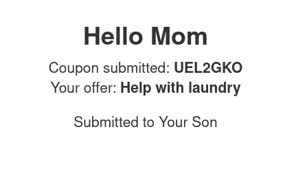

# Couponbot

Simple Flask website used for input of one-time use coupons, that when redeemed,
will send an email to the issuer.

## What is this?

You know those favour coupons that you gift to people for things like Mother's
Day, like "take out the trash", or "cook dinner tonight", which they can then
use to make you do things for them? This is a simple (read: useless) web app
version, where a coupon user can submit one-time use coupon codes, which if
valid, will send an email to the coupon issuer informing them of the coupon use.

## Usage

This Flask app requires the following setup:

- A PostgreSQL database with 1 table, `codes` with the following columns:
	- `code CHAR(7) PRIMARY KEY`: the code corresponding to the coupon
	  (7-character alphanumeric, capitals only),
	- `offer TEXT`: the offer associated with the code,
	- `used BOOLEAN`: whether the coupon has been used yet, all initialised to
	  `'f'`
- A Mailgun API key
- These environment variables:
	- `NAME`: Name of the coupon user
	- `RECIPIENT`: Name of person to send coupon use to, coupon issuer
	- Mailgun configuration for email to send to RECIPIENT:
		- `MAILGUN_SUBJECT`: subject of email
		- `MAILGUN_DOMAIN`: mailgun domain (usually `[something].mailgun.org`)
		- `MAILGUN_FROM`: email to send from (usually `[Name]
		  <[something]@[MAILGUN_DOMAIN]>`
		- `MAILGUN_TO`: email of RECIPIENT
		- `MAILGUN_API_KEY`: secret API key from Mailgun account
	- `DATABASE_URL`: URL to use to connect to PostgreSQL database

## Screenshots

## Dependencies

As in `requirements.txt`, plus:

- Mailgun
- PostgreSQL

---
Made for Mother's Day 2020
